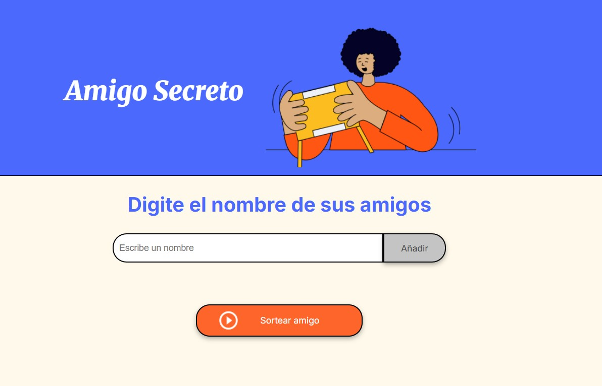
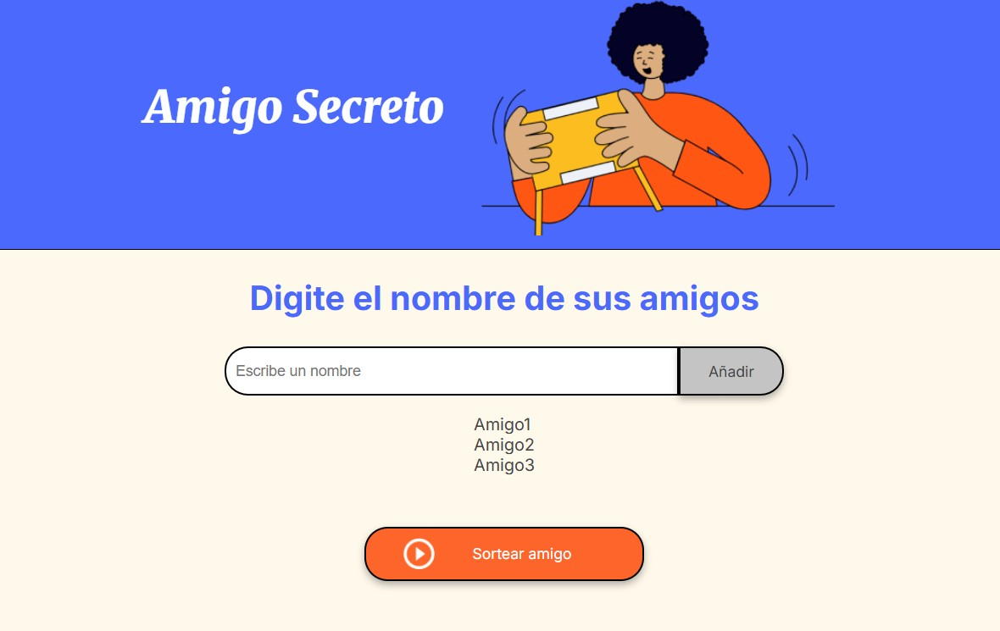
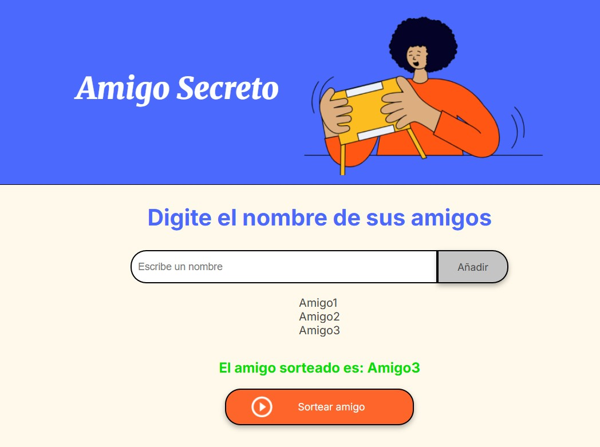

# Amigo Secreto

Amigo Secreto es una aplicación web desarrollada con HTML, CSS y JavaScript. Permite ingresar nombres de amigos, validarlos (evitando duplicados y vacíos), mostrarlos en una lista y realizar un sorteo aleatorio para elegir al amigo secreto.

## Funcionalidades

- Agregar nombres mediante un campo de texto.
- Validar entradas vacías y evitar duplicados.
- Mostrar la lista de amigos agregados.
- Sortear aleatoriamente un nombre de la lista.

## Capturas de pantalla

### 1. Formulario para agregar nombres

Formulario donde el usuario puede ingresar nombres. Se valida que el campo no esté vacío y que no se repitan nombres.

### 2. Lista de amigos agregados

Vista de la lista dinámica que muestra los nombres ingresados correctamente.

### 3. Resultado del sorteo

Resultado del sorteo mostrando el nombre elegido aleatoriamente como “amigo secreto”.

## Cómo usar

1. Cloná el repositorio o descargá los archivos.
2. Abrí `index.html` en tu navegador.
3. Ingresá nombres y presioná “Añadir”.
4. Presioná “Sortear amigo” para ver el resultado.

## Autor

Matias — Proyecto realizado como parte de un desafío de curso para practicar lógica de programación.
